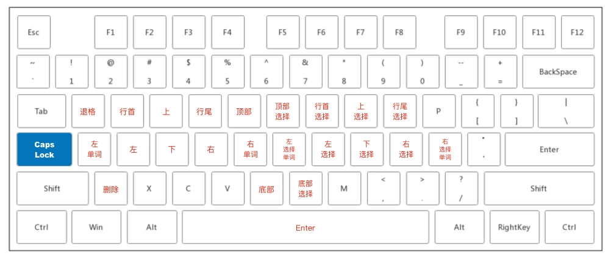

# CAPSLOCK YES!



## 使用

```
# Import Rule URL
karabiner://karabiner/assets/complex_modifications/import?url=https://raw.githubusercontent.com/lianginx/capslock-yes/master/capslock-yes.json
```

1. 下载 [Karabiner-Elements](https://karabiner-elements.pqrs.org/) 并安装。
2. 复制上面的 URL 并使用浏览器打开以导入配置文件。
3. 点击 `Add rule` 查看导入的规则，然后点击 `Enable` 按钮启用你需要的规则。
