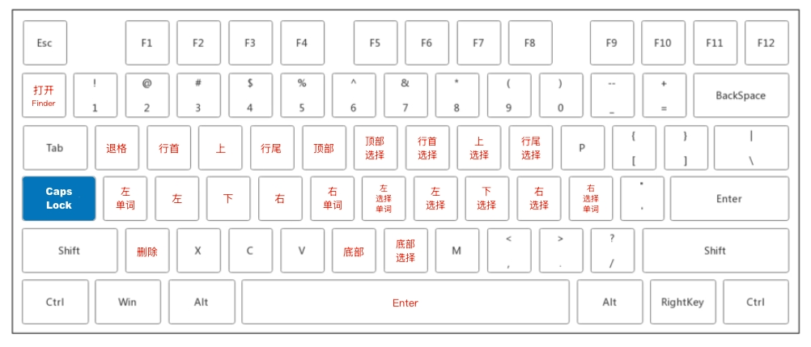

# CAPSLOCK YES

通过 [Karabiner-Elements](https://karabiner-elements.pqrs.org/) 将按下 `CapsLock` 键映射为按下 `Ctrl+Option+Command+Shift` 组合键，搭配字母键组合出一套全新的快捷键；

让你的双手在编辑代码时，不再需要离开字母区就能随心所欲地快速导航和选中文字；

右手使用鼠标时，也不再需要放开鼠标就能精准导航光标到想要的位置；



## 使用

```text
karabiner://karabiner/assets/complex_modifications/import?url=https://raw.githubusercontent.com/lianginx/capslock-yes/master/capslock-yes.json
```

1. 下载 [Karabiner-Elements](https://karabiner-elements.pqrs.org/) 并安装。
2. 复制上面的 URL 并使用浏览器打开以导入配置文件。
3. 点击 `Add rule` 查看导入的规则，然后点击 `Enable` 按钮启用你需要的规则。
